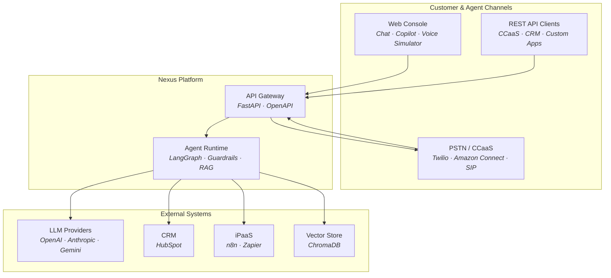
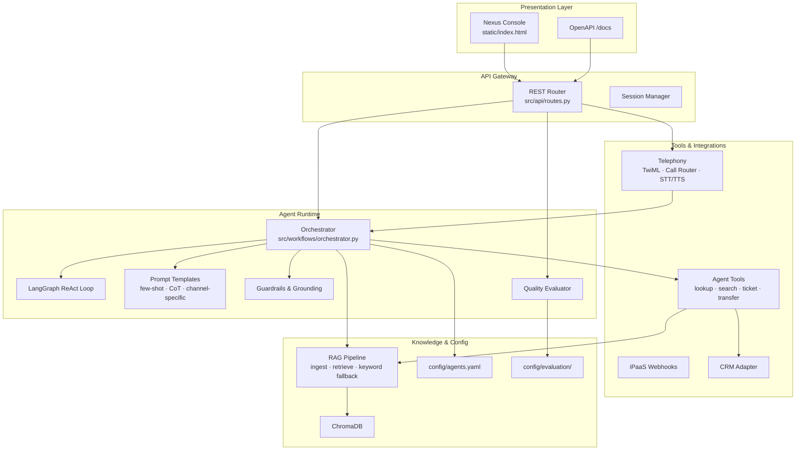
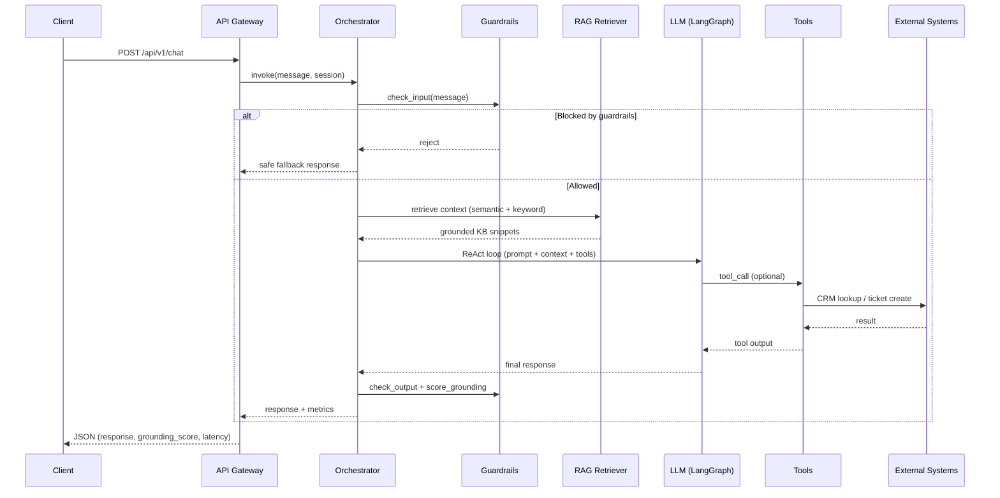
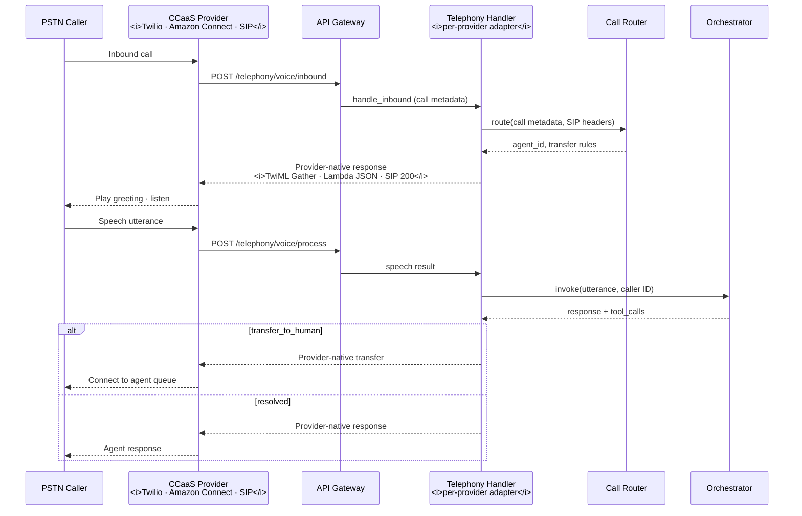
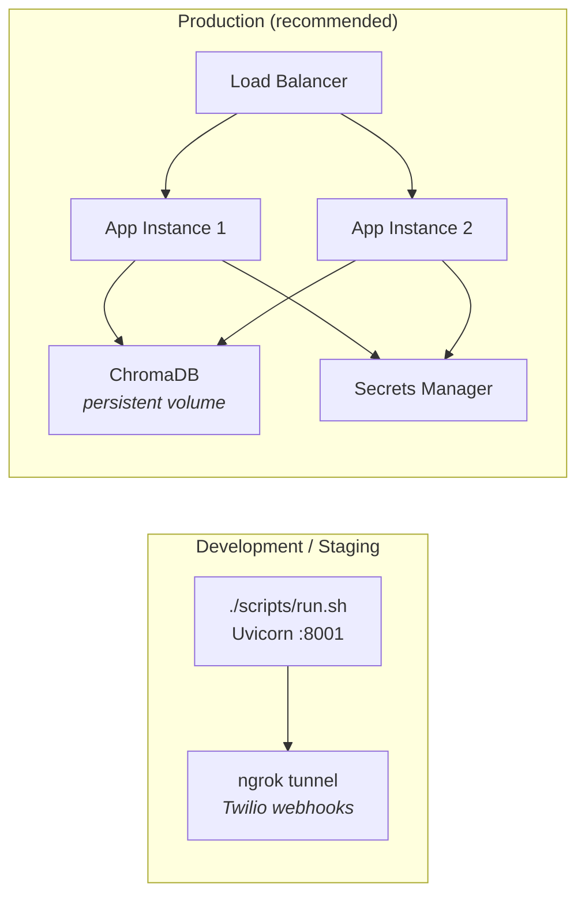

<div align="center">

# Nexus · Enterprise Voice & Chat AI Platform

**Production-grade omnichannel AI agents for contact centers — chat, voice, and copilot from one runtime.**

[](https://github.com/ShubhamRSY/voice-agents/actions/workflows/ci.yml)
[](https://www.python.org/downloads/)
[](LICENSE)
[](tests/)

[Quick Start](#quick-start) · [Architecture](#architecture) · [API](#api-reference) · [Project Layout](#project-layout)

**Repository:** [github.com/ShubhamRSY/voice-agents](https://github.com/ShubhamRSY/voice-agents)

</div>

---

## About this project

**Nexus** is an enterprise AI agent platform built for **contact centers, CCaaS deployments, and customer-support automation**. It lets you deploy and operate AI agents across **chat**, **voice (PSTN/Twilio, Amazon Connect, generic SIP/CCaaS)**, and **agent-assist copilot** channels — all backed by the same orchestration core, knowledge base, and integration layer.

### What problem it solves

Support organizations need AI that can:

- Answer customers on **web chat** and **phone calls** with consistent, grounded responses
- **Look up CRM records**, search knowledge bases, and **create tickets** via tool calling
- **Escalate to humans** when containment fails, with full telephony routing
- **Assist human agents** with draft responses (copilot mode)
- Emit **lifecycle events** to n8n/Zapier for workflow automation
- Be **measured and regression-tested** for containment, latency, grounding, and hallucination risk

Nexus packages all of this into a single FastAPI application with a built-in **Nexus AI Ops** web console, REST API, and offline mock mode for demos and CI.

### Who it's for

| Audience | How they use Nexus |
|----------|-------------------|
| **Platform engineers** | Deploy, configure agents in YAML, wire Twilio/HubSpot, run CI |
| **Contact center ops** | Operate chat + voice agents, monitor grounding metrics |
| **Support team leads** | Use copilot to draft responses; review evaluation reports |
| **Developers** | Extend tools, prompts, RAG pipeline, and telephony routing |

### Three channels, one platform

| Channel | Agent ID | What it does |
|---------|----------|--------------|
| **Chat** | `chat_support` | Customer self-service with sessions, RAG, CRM lookup, ticketing |
| **Voice** | `voice_support` | PSTN call flows via Twilio webhooks; in-browser simulator for dev |
| **Copilot** | `copilot` | Drafts responses for human agents from conversation context |

> **No API key required for local dev.** Without `OPENAI_API_KEY`, the platform uses a mock LLM and keyword RAG fallback — chat, voice simulator, and all **130+ tests** still work.

### Optional integrations (no keys required to start)

| Provider | Purpose | Configure via |
|----------|---------|---------------|
| **OpenAI** | LLM, embeddings, STT, TTS | `config/environment/.env` or Nexus **Integrations** panel |
| **Anthropic** | LLM (copilot / chat) | `config/environment/.env` or UI |
| **Twilio** | Real PSTN voice calls | `config/environment/.env` or UI |
| **Amazon Connect** | AWS cloud contact center voice | `config/environment/.env` or UI |
| **Generic SIP/CCaaS** | Any RFC 3261 SIP provider via the base adapter | Extend `src/telephony/ccaas_base.py` |
| **HubSpot** | CRM lookup & tickets | `config/environment/.env` or UI |
| **n8n / Zapier** | Workflow webhooks on lifecycle events | UI or API |

Credentials saved in the UI are **encrypted at rest** (Fernet) in `data/integrations.vault`. Mock mode works when nothing is configured.

---

## Key capabilities

| Area | What you get |
|------|--------------|
| **Orchestration** | LangGraph ReAct agents with per-agent tools, prompts, and LLM parameters |
| **RAG** | Document ingestion → ChromaDB vectors → semantic + keyword retrieval |
| **Safety** | Prompt-injection guardrails, output sanitization, hallucination scoring |
| **Telephony** | Twilio TwiML, skill-based routing, VIP detection, SIP headers, human transfer |
| **CRM** | HubSpot adapter with mock fallback when credentials are absent |
| **iPaaS** | Outbound webhooks for conversation/ticket/escalation events |
| **Evaluation** | Automated suites for containment, tool accuracy, latency, benchmarks |
| **Feedback loop** | CSAT-driven continuous improvement with auto-adjustments for temperature, tokens, and escalation thresholds |
| **Console** | Nexus web UI — streaming chat, voice HUD, sessions, citation chips, integrations manager |
| **Secrets vault** | Fernet-encrypted credential storage with masked API responses |
| **CI/CD** | GitHub Actions: unit, E2E, Docker smoke — fully offline |

---

## Architecture

### Design principles

| Principle | Description |
|-----------|-------------|
| **Omnichannel** | One orchestrator serves chat, voice, and copilot with channel-specific prompts |
| **Configuration-driven** | Agent behavior, LLM params, and routing in `config/agents.yaml` — no code changes |
| **Grounded responses** | RAG retrieval precedes generation; every response carries grounding metrics |
| **Graceful degradation** | Mock LLM + keyword search when API keys or vector scores are unavailable |
| **Observable** | Structured logging, per-request metrics, automated evaluation for regression control |

### System context

How Nexus sits in your enterprise stack:



### Layered architecture

Internal module boundaries and data flow:



### Chat request flow



### Voice request flow (PSTN / CCaaS)



### Deployment topology



**Default:** single-process Uvicorn on port **8001** (`./scripts/run.sh`). For production, run stateless instances behind a load balancer, persist ChromaDB to shared storage, and inject credentials via a secrets manager.

---

## Component reference

| Layer | Component | Responsibility | Module |
|-------|-----------|----------------|--------|
| Presentation | Nexus Console | Chat, copilot, voice simulation UI | `static/index.html` |
| API Gateway | REST Router | HTTP ingress, sessions, OpenAPI | `src/api/routes.py` |
| API Gateway | App Host | Lifespan, CORS, static assets | `src/main.py` |
| Runtime | Orchestrator | Session state, RAG injection, LLM invoke | `src/workflows/orchestrator.py` |
| Runtime | LangGraph Agent | ReAct loop with tool calling | `src/workflows/orchestrator.py` |
| Runtime | Prompt Engine | Channel templates, few-shot, CoT | `src/prompts/templates.py` |
| Runtime | LLM Factory | Multi-provider model instantiation | `src/llm/factory.py` |
| Runtime | Guardrails | Injection blocking, output sanitization | `src/llm/guardrails.py` |
| Runtime | Grounding Scorer | Hallucination risk, KB overlap | `src/llm/hallucination.py` |
| Runtime | Evaluator | Containment, benchmarks, regression | `src/evaluation/evaluator.py` |
| Tools | Agent Tools | CRM, KB search, tickets, transfer | `src/agents/tools.py` |
| Integration | Telephony | CCaaS adapters — TwiML, Amazon Connect, SIP | `src/telephony/ccaas_base.py` |
| Integration | Twilio Handler | TwiML, speech gather, call sessions | `src/telephony/twilio_handler.py` |
| Integration | Amazon Connect Handler | Lambda-style contact flow webhooks | `src/telephony/amazon_connect_handler.py` |
| Integration | SIP Router | Skill routing, VIP, SIP headers | `src/telephony/call_router.py` |
| Integration | CRM Adapter | HubSpot contact lookup | `src/integrations/crm.py` |
| Integration | Webhooks | iPaaS lifecycle events | `src/integrations/webhooks.py` |
| Integration | Secrets Vault | Encrypted API keys & webhook URLs | `src/integrations/secrets_vault.py` |
| Knowledge | RAG Pipeline | Ingestion, chunking, embedding | `src/rag/ingestion.py` |
| Knowledge | Retriever | Semantic + keyword fallback | `src/rag/retriever.py` |
| Knowledge | Vector Store | ChromaDB + score normalization | `src/rag/vector_store.py` |
| Config | Agent Registry | Per-channel agents, tools, LLM config | `config/agents.yaml` |
| Config | Eval Fixtures | Test cases and benchmarks | `config/evaluation/` |

---

## Tech stack

| Layer | Technology |
|-------|------------|
| API | FastAPI, Uvicorn |
| Orchestration | LangChain, LangGraph |
| LLMs | OpenAI GPT-4o-mini, Anthropic, Gemini |
| Vector DB | ChromaDB |
| Telephony | Twilio, Amazon Connect, generic SIP/CCaaS |
| CRM | HubSpot REST API |
| Testing | pytest (unit + E2E + NFR) |
| Frontend | Nexus console (HTML/CSS/JS) |
| CI | GitHub Actions |

---

## Quick start

### Prerequisites

- Python 3.11+
- (Optional) `OPENAI_API_KEY` for real LLM responses and OpenAI embeddings

### Install and run

```bash
git clone https://github.com/ShubhamRSY/voice-agents.git
cd voice-agents

python3 -m venv .venv && source .venv/bin/activate
pip install -r config/deps/requirements.txt && pip install -e ".[dev]"

cp config/environment/.env.example config/environment/.env   # optional — add API keys
python scripts/ingest_kb.py data/knowledge_base/
./scripts/run.sh
```

| URL | Description |
|-----|-------------|
| [http://127.0.0.1:8001/](http://127.0.0.1:8001/) | Nexus console (Chat, Copilot, Voice) |
| [http://127.0.0.1:8001/docs](http://127.0.0.1:8001/docs) | Interactive API documentation |

**Smoke test:**
```bash
curl -s -X POST http://127.0.0.1:8001/api/v1/chat \
  -H "Content-Type: application/json" \
  -d '{"message":"How do I reset my password?","session_id":"demo-1"}' | jq
```

---

## Web console

The **Nexus AI Ops** console (`static/index.html`) at [http://127.0.0.1:8001](http://127.0.0.1:8001):

| Tab | Try these prompts |
|-----|-------------------|
| **Chat** | `How do I reset my password?` · `Look up jane@example.com` · `My API returns 403` |
| **Copilot** | Paste a conversation summary → get a draft response for the human agent |
| **Voice** | Answer call → type caller speech → request escalation to test transfer routing |

### Console features

- **Streaming chat** with RAG citation chips and grounding metrics
- **Session management** — history, clear session, per-session delete
- **Voice HUD** — call timer, waveform, STT/TTS simulation
- **Collapsible side panel** — click the main chat area to slide the panel closed; reopen with **☰** (header) or the **› Panel** tab on the left edge
- **Integrations manager** (sidebar → Integrations) — configure OpenAI, Anthropic, Twilio, HubSpot, and n8n/Zapier without editing files

### Integrations panel

1. Open **☰** menu → scroll to **Integrations**
2. Enter API keys or webhook URLs → **Save encrypted**
3. Saved keys show masked values (e.g. `sk-p••••IP0A`) with **Change** and **Remove**
4. **Remove** shows a confirmation dialog before deleting from the vault

Works alongside `config/environment/.env` — vault values override env when both are set.

---

## Agents & LLM configuration

Three agents are defined in `config/agents.yaml`:

| Agent | Channel | Tools |
|-------|---------|-------|
| `chat_support` | Chat | lookup_customer, search_knowledge_base, create_ticket, update_crm |
| `voice_support` | Voice | lookup_customer, search_knowledge_base, create_ticket, transfer_to_human |
| `copilot` | Copilot | search_knowledge_base, draft_response, summarize_conversation |

**Per-agent LLM parameters** (all configurable in YAML):

| Parameter | Config key | Purpose |
|-----------|------------|---------|
| Temperature | `temperature` | Randomness (0 = focused, 2 = creative) |
| Max tokens | `max_tokens` | Output length limit |
| Top P / Top K | `llm.top_p`, `llm.top_k` | Nucleus / top-K sampling |
| Stop sequences | `llm.stop_sequences` | Halt generation at phrases |
| Chain of thought | `llm.chain_of_thought` | Internal step-by-step reasoning |
| Few-shot | `llm.few_shot_enabled` | Example Q&A in system prompt |

**Live config:** `GET /api/v1/llm/config`

**Response metrics** (every LLM reply):
```json
{
  "grounding_score": 0.42,
  "hallucination_risk": "low",
  "rag_chunks_used": 3,
  "response_time_ms": 842,
  "sources": [{"source": "faq", "score": 0.91}]
}
```

---

## API reference

| Method | Endpoint | Description |
|--------|----------|-------------|
| `GET` | `/api/v1/health` | Health check |
| `POST` | `/api/v1/chat` | Send a chat message |
| `POST` | `/api/v1/copilot` | Copilot assist request |
| `DELETE` | `/api/v1/chat/{session_id}` | End / clear a session |
| `GET` | `/api/v1/agents` | List configured agents |
| `GET` | `/api/v1/llm/config` | View LLM parameters |
| `POST` | `/api/v1/rag/ingest` | Ingest documents into vector store |
| `POST` | `/api/v1/rag/search` | Search knowledge base |
| `POST` | `/api/v1/telephony/simulate` | Voice call simulator (no Twilio) |
| `POST` | `/api/v1/telephony/voice/inbound` | Twilio / Amazon Connect inbound webhook |
| `POST` | `/api/v1/telephony/voice/process` | Twilio / Amazon Connect speech webhook |
| `POST` | `/api/v1/integrations/webhooks` | Register iPaaS webhook URL |
| `DELETE` | `/api/v1/integrations/webhooks/{event_type}` | Remove webhook URL |
| `GET` | `/api/v1/integrations/status` | Integration status (masked keys) |
| `PUT` | `/api/v1/integrations/credentials` | Save encrypted API keys |
| `DELETE` | `/api/v1/integrations/credentials/{key}` | Remove a stored credential |
| `POST` | `/api/v1/evaluation/run` | Run automated evaluation suite |
| `GET` | `/api/v1/feedback/{agent_id}/report` | Feedback loop report for an agent |
| `GET` | `/api/v1/feedback/{agent_id}/analyze` | Run analysis and return improvement suggestions |
| `POST` | `/api/v1/feedback/{agent_id}/snapshot` | Record a performance snapshot |
| `GET` | `/api/v1/feedback/{agent_id}/config` | Get feedback loop configuration |
| `PUT` | `/api/v1/feedback/{agent_id}/config` | Update feedback loop configuration |
| `POST` | `/api/v1/feedback/{agent_id}/auto-adjust` | Auto-tune agent parameters |

---

## Telephony (Twilio · Amazon Connect · SIP)

### Twilio

```bash
# config/environment/.env
TWILIO_ACCOUNT_SID=AC...
TWILIO_AUTH_TOKEN=...
TWILIO_PHONE_NUMBER=+1...
TWILIO_WEBHOOK_BASE_URL=https://your-tunnel.ngrok.io

ngrok http 8001
```

Set Twilio voice webhook to `POST {BASE_URL}/api/v1/telephony/voice/inbound`.

### Amazon Connect

The `AmazonConnectVoiceHandler` (`src/telephony/amazon_connect_handler.py`) accepts the standard
Amazon Connect Lambda event payload format.  Wire it in a contact flow using an **Invoke AWS Lambda**
or **External HTTP** block pointed at:

```
POST {BASE_URL}/api/v1/telephony/voice/inbound
```

The handler expects `Details.ContactData.ContactId` and `Details.ContactData.CustomerEndpoint.Address`.
Speech input is passed via the `SpeechResult` attribute (set by a **Get customer input** block).

**Response** is JSON — the contact flow reads `message` (TTS), `transfer_requested` (branching),
and `transfer_phone`.

### Generic SIP / CCaaS

Extend `CcaasVoiceHandler` (`src/telephony/ccaas_base.py`) to support any RFC 3261 SIP provider
or custom CCaaS platform.  Implement the three abstract methods:

- `handle_inbound` — greet and collect speech
- `handle_process` — invoke the agent and return provider-native response
- `handle_status_callback` — lifecycle events

Call routing supports skill-based rules, VIP detection, SIP `X-*` headers, and fallback destinations
(`src/telephony/call_router.py`).

---

## iPaaS integrations

Nexus emits lifecycle events to registered webhook URLs:

| Event | When |
|-------|------|
| `conversation.started` | New chat session |
| `conversation.ended` | Session closed |
| `ticket.created` | Support ticket created |
| `conversation.escalated` | Human transfer requested |
| `feedback.suggestion` | Improvement suggestion generated |
| `feedback.auto_adjust` | Agent parameters auto-adjusted |
| `connect.contact_ended` | Amazon Connect call completed |

**Templates** (import into your automation tool):

- `docs/integrations/templates/n8n-workflow.json`
- `docs/integrations/templates/zapier-setup.md`

---

## Continuous Improvement / Feedback Loop

The feedback loop engine (`src/feedback/engine.py`) tracks agent performance over time
and automatically suggests (or applies) parameter adjustments:

| Trigger | Adjustment |
|---------|------------|
| Containment rate below target | Review escalation logs, add KB articles |
| CSAT score below target | Adjust temperature, prompt tone, or max_tokens |
| Hallucination rate > 15% | Lower temperature, reduce top_k |
| Response time > 2000ms | Reduce model size or max_tokens |

**API:**

```bash
# Run analysis and get suggestions
curl http://localhost:8001/api/v1/feedback/voice_support/analyze

# Auto-tune agent parameters
curl -X POST http://localhost:8001/api/v1/feedback/voice_support/auto-adjust

# Get full feedback report
curl http://localhost:8001/api/v1/feedback/voice_support/report
```

---

## Evaluation

```bash
python scripts/run_evaluation.py
# or
curl -X POST http://127.0.0.1:8001/api/v1/evaluation/run
```

| Metric | What it measures |
|--------|------------------|
| Containment rate | Queries resolved without escalation |
| Tool accuracy | Correct tool selection |
| Response time | Latency in milliseconds |
| Hallucination rate | High-risk responses |
| Grounding score | Overlap with retrieved KB context |
| Benchmarks | Standardized regression tests |

Fixtures: `config/evaluation/test_cases.json`, `config/evaluation/benchmarks.json`

---

## Project layout

```
voice-agents/
├── README.md                       # Project overview (this file)
├── pyproject.toml                  # Python package & pytest config
├── .gitignore
│
├── config/
│   ├── agents.yaml                 # Agents, RAG, guardrails, eval settings
│   ├── evaluation/                 # Test cases & benchmark fixtures
│   │   ├── test_cases.json
│   │   └── benchmarks.json
│   ├── environment/                # Environment variables (not committed)
│   │   ├── .env.example            # Template — copy to .env
│   │   └── .env                    # Your local secrets (gitignored)
│   └── deps/
│       └── requirements.txt        # Pip install pointer
│
├── deploy/
│   └── docker/
│       ├── Dockerfile              # Production container image
│       └── .dockerignore           # Docker build exclusions
│
├── data/
│   ├── knowledge_base/             # FAQ documents (ingest source)
│   ├── chroma/                     # ChromaDB persistence (gitignored)
│   └── integrations.vault          # Encrypted API keys (gitignored)
│
├── docs/
│   └── integrations/templates/     # n8n & Zapier workflow templates
│
├── scripts/
│   ├── run.sh                      # Start dev server (port 8001)
│   ├── ci.sh                       # Full local CI suite
│   ├── ingest_kb.py                # Knowledge base ingestion
│   ├── run_evaluation.py           # Evaluation runner
│   └── demo_chat.py                # CLI chat demo
│
├── src/                            # Application source code
│   ├── main.py                     # FastAPI entry point
│   ├── config.py                   # Settings & path constants
│   ├── api/                        # REST routes & sessions
│   ├── workflows/                  # LangGraph orchestrator
│   ├── agents/                     # LangChain tools
│   ├── rag/                        # Ingestion, vector store, retriever
│   ├── llm/                        # Factory, guardrails, grounding
│   ├── telephony/                  # CCaaS adapters, call router, STT/TTS
│   │   ├── ccaas_base.py           # Abstract CCaaS voice handler
│   │   ├── twilio_handler.py       # Twilio TwiML adapter
│   │   ├── amazon_connect_handler.py  # Amazon Connect Lambda adapter
│   │   └── call_router.py          # Skill routing, SIP, VIP
│   ├── feedback/                   # Feedback loop & continuous improvement
│   │   ├── engine.py               # CSAT-driven parameter tuning
│   │   └── __init__.py
│   ├── integrations/               # CRM, webhooks, secrets vault
│   ├── evaluation/                 # Quality evaluator
│   └── prompts/                    # Channel prompt templates
│
├── static/
│   └── index.html                  # Nexus AI Ops web console
│
├── tests/
│   ├── test_*.py                   # Unit & integration tests
│   ├── test_secrets_vault.py
│   ├── test_integrations_api.py
│   ├── test_vector_store.py
│   ├── e2e/                        # End-to-end journey tests
│   └── reports/                    # CI output (XML gitignored)
│
└── .github/workflows/ci.yml        # GitHub Actions pipeline
```

---

## Environment variables

Copy `config/environment/.env.example` → `config/environment/.env`:

| Variable | Required | Description |
|----------|----------|-------------|
| `OPENAI_API_KEY` | No | Real GPT responses + OpenAI embeddings |
| `ANTHROPIC_API_KEY` | No | Anthropic-powered models |
| `TWILIO_ACCOUNT_SID` | No | Real phone call integration |
| `TWILIO_AUTH_TOKEN` | No | Twilio auth |
| `TWILIO_PHONE_NUMBER` | No | Your Twilio number |
| `TWILIO_WEBHOOK_BASE_URL` | No | ngrok or production URL |
| `AWS_ACCESS_KEY_ID` | No | Amazon Connect API access |
| `AWS_SECRET_ACCESS_KEY` | No | Amazon Connect API secret |
| `AWS_REGION` | No | AWS region (default: us-east-1) |
| `AMAZON_CONNECT_INSTANCE_ID` | No | Amazon Connect instance for outbound calls |
| `HUBSPOT_API_KEY` | No | Live HubSpot CRM (mock if empty) |
| `INTEGRATIONS_ENCRYPTION_KEY` | No | Fernet key for `data/integrations.vault` |
| `SETTINGS_ADMIN_TOKEN` | No | Protect credential saves with `X-Settings-Token` header |
| `WEBHOOK_SIGNING_SECRET` | No | HMAC signature for outbound n8n/Zapier events |

### Encrypted integrations (UI or API)

Optional providers can be configured in the **Nexus sidebar → Integrations** panel or via API. Credentials are encrypted at rest in `data/integrations.vault` (Fernet, AES). Vault values override `config/environment/.env` when both are set. API responses only show **masked** keys — never full secrets.

| Endpoint | Description |
|----------|-------------|
| `GET /api/v1/integrations/status` | Provider status (masked keys, webhook state) |
| `PUT /api/v1/integrations/credentials` | Save encrypted API keys |
| `DELETE /api/v1/integrations/credentials/{key}` | Remove one credential |
| `POST /api/v1/integrations/webhooks` | Register n8n/Zapier webhook URL |
| `DELETE /api/v1/integrations/webhooks/{event_type}` | Remove webhook URL |

**Production:** set `INTEGRATIONS_ENCRYPTION_KEY` for a stable vault key and `SETTINGS_ADMIN_TOKEN` to require `X-Settings-Token` on save/delete requests.

**Storage files** (gitignored): `data/integrations.vault`, `data/.vault_key`

---

## Testing

```bash
./scripts/ci.sh                  # full suite — unit + E2E + coverage
pytest tests/ tests/e2e/ -v      # quick local run
```

130+ tests run in offline mock mode (no API keys). Report: [`tests/reports/TEST_REPORT.md`](tests/reports/TEST_REPORT.md)

---

## Docker

```bash
docker build -f deploy/docker/Dockerfile --ignorefile deploy/docker/.dockerignore -t nexus-voice-agents .
docker run -p 8000:8000 --env-file config/environment/.env nexus-voice-agents
```

Health: `GET /api/v1/health` · App: `http://localhost:8000/`

---

<div align="center">

**MIT License** · [Shubham RSY](https://github.com/ShubhamRSY)

</div>
