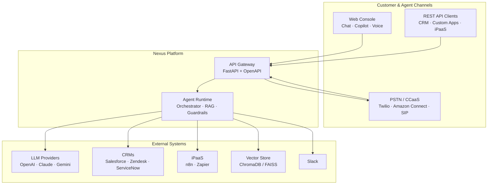

<div align="center">

# Nexus · Enterprise Voice & Chat AI Platform

**Production-grade omnichannel AI agents for contact centers — chat, voice, and copilot from one runtime.**

[](https://github.com/ShubhamRSY/voice-agents/actions/workflows/ci.yml)
[](https://www.python.org/downloads/)
[](LICENSE)
[](tests/)

[Quick Start](#quick-start) · [Architecture](#architecture) · [API Reference](#api-reference) · [Project Layout](#project-layout)

**Repository:** [github.com/ShubhamRSY/voice-agents](https://github.com/ShubhamRSY/voice-agents)
**Architecture Docs:** [`docs/technical/ARCHITECTURE.md`](docs/technical/ARCHITECTURE.md) · [HTML](docs/technical/index.html)

</div>

---

## What Is Nexus?

**Nexus** is an open-source, omnichannel AI agent platform built for customer support and contact centres. It replaces three separate tools — live chat, AI copilot, and phone systems — with one AI-powered console. A single orchestrator routes conversations across chat, copilot, and voice (Twilio, Amazon Connect, generic SIP/CCaaS), remembers context, retrieves knowledge, and streams responses in real time.

| Channel | What it does |
|---------|--------------|
| **Chat** | Live AI conversation with SSE streaming, RAG citations, full session history |
| **Copilot** | Agent-assist mode — paste a transcript, get an AI-suggested reply. Human-in-the-loop. |
| **Voice** | PSTN calls via Twilio, Amazon Connect, or any SIP/CCaaS. Live STT, AI TTS, call recording. |

> **No API key required for local dev.** Without `OPENAI_API_KEY`, the platform uses a mock LLM and keyword RAG fallback — chat, voice simulator, and all tests still work.

---

## Key Capabilities

| Capability | What It Means |
|---|---|
| **Omnichannel Console** | Chat, copilot, and voice calls in one UI. No tab switching. |
| **Multi-LLM** | Swap between OpenAI GPT-4o, Anthropic Claude 3.5, and Google Gemini 2.0 per conversation. No lock-in. |
| **Live Streaming** | AI responses stream token-by-token via SSE. Operators see answers form in real time. |
| **Voice (PSTN)** | Inbound and outbound calls through Twilio. Live transcription, AI voice responses. |
| **Amazon Connect** | Lambda-style webhook handler for AWS Connect contact flows. |
| **Generic SIP/CCaaS** | Abstract `CcaasVoiceHandler` base class to add any SIP or CCaaS provider. |
| **Feedback Engine** | Post-interaction CSAT surveys trigger automatic AI behaviour tuning. No manual tweaking. |
| **RAG** | Retrieval-augmented generation grounded in your knowledge base. Citations on every answer. |
| **Audit Trail** | Every message, tool call, and response logged with timestamps. Compliance-ready. |
| **Encrypted Vault** | API keys stored in AES-256-GCM encrypted database. Never logged or hardcoded. |
| **iPaaS Events** | Lifecycle webhooks for n8n/Zapier — ticket created, escalated, feedback auto-adjust. |

---

## Architecture

### Design Principles

| Principle | Description |
|-----------|-------------|
| **Omnichannel** | One orchestrator serves chat, voice, and copilot with channel-specific prompts |
| **Configuration-driven** | Agent behavior, LLM params, and routing in `config/agents.yaml` — no code changes |
| **Grounded responses** | RAG retrieval precedes generation; every response carries grounding metrics |
| **Graceful degradation** | Mock LLM + keyword search when API keys or vector scores are unavailable |
| **Observable** | Structured logging, per-request metrics, automated evaluation for regression control |
| **Multi-tenant** | Tenant isolation at the middleware and database query level |

### System Context



### Data Flow

```
User Message (any channel)
        │
        ▼
  API Gateway (FastAPI)
        │
        ├──► Auth & Tenant Middleware
        ├──► Rate Limiting
        │
        ▼
  Channel Handler (normalises input)
        │
        ▼
  Agent Orchestrator
        │
        ├──► Builds channel-specific prompt
        ├──► Executes tools (RAG, CRM, etc.)
        ├──► Calls LLM (OpenAI / Claude / Gemini)
        │
        ▼
  Response Streams Back
        ├──► Chat: SSE to web console (token by token)
        ├──► Copilot: Full suggested reply
        └──► Voice: TTS audio via Twilio Media Streams
        │
        ▼
  Logging & Feedback
        ├──► Session + messages stored in DB
        └──► CSAT survey → Feedback Engine → auto-adjust
```

---

## Core Components

| Component | Responsibility | Source |
|-----------|----------------|--------|
| **API Gateway** | HTTP ingress, CORS, tenant isolation, rate limiting, auth | [`src/main.py`](src/main.py) |
| **REST Routes** | All API endpoints — chat, voice, copilot, RAG, feedback, integrations | [`src/api/routes.py`](src/api/routes.py) |
| **Agent Orchestrator** | Routes requests to channel handlers, builds prompts, executes tools, invokes LLM | [`src/agents/orchestrator.py`](src/agents/orchestrator.py) |
| **Twilio Handler** | TwiML, speech gather, call sessions, media streams | [`src/telephony/twilio_handler.py`](src/telephony/twilio_handler.py) |
| **Amazon Connect Handler** | Lambda-style JSON webhooks for AWS Connect contact flows | [`src/telephony/amazon_connect_handler.py`](src/telephony/amazon_connect_handler.py) |
| **CCaaS Base** | Abstract `CcaasVoiceHandler` — extend for any SIP/CCaaS provider | [`src/telephony/ccaas_base.py`](src/telephony/ccaas_base.py) |
| **Call Router** | Skill-based routing, VIP detection, SIP headers | [`src/telephony/call_router.py`](src/telephony/call_router.py) |
| **LLM Client** | Multi-provider (OpenAI, Anthropic, Gemini) | [`src/llm/client.py`](src/llm/client.py) |
| **RAG Pipeline** | Ingestion, chunking, embedding, semantic + keyword retrieval | [`src/rag/`](src/rag/) |
| **Feedback Engine** | CSAT-driven auto-adjustment of temperature, tokens, thresholds | [`src/feedback/engine.py`](src/feedback/engine.py) |
| **Integrations Vault** | AES-256-GCM encrypted credential storage | [`src/integrations/vault.py`](src/integrations/vault.py) |
| **Webhooks** | Lifecycle events to n8n/Zapier | [`src/integrations/webhooks.py`](src/integrations/webhooks.py) |
| **Database** | SQLite with schema migrations | [`src/database.py`](src/database.py) |
| **Auth** | JWT authentication | [`src/auth.py`](src/auth.py) |

Full architecture document: [`docs/technical/ARCHITECTURE.md`](docs/technical/ARCHITECTURE.md) · [HTML version](docs/technical/index.html)

---

## Integrations

| Category | Providers | Documentation |
|---|---|---|
| **LLMs** | OpenAI GPT-4o, Anthropic Claude 3.5, Google Gemini 2.0 | `config/agents.yaml` + UI |
| **Telephony** | Twilio (PSTN + WhatsApp), Amazon Connect, generic SIP/CCaaS | [Twilio Setup](docs/integrations/twilio-setup.md) |
| **CRMs** | Salesforce, Zendesk, ServiceNow | [CRM Setup](docs/integrations/crm-setup.md) |
| **Notifications** | Slack | [Slack Setup](docs/integrations/slack-setup.md) |
| **iPaaS** | n8n, Zapier — event-driven workflows | [n8n Template](docs/integrations/templates/n8n-workflow.json) · [Zapier Setup](docs/integrations/templates/zapier-setup.md) |

All credentials stored in the encrypted Integrations Vault — never in config files or plain text.

---

## Quick Start

### Prerequisites

- Python 3.11+
- (Optional) `OPENAI_API_KEY` for real LLM responses

### Install and Run

```bash
git clone https://github.com/ShubhamRSY/voice-agents.git
cd voice-agents

python3 -m venv .venv && source .venv/bin/activate
pip install -e ".[dev]"

cp config/environment/.env.example config/environment/.env   # optional — add API keys
uvicorn src.main:app --reload --port 8001
```

| URL | Description |
|-----|-------------|
| [http://127.0.0.1:8001/](http://127.0.0.1:8001/) | Nexus console (Chat, Copilot, Voice) |
| [http://127.0.0.1:8001/docs](http://127.0.0.1:8001/docs) | Interactive API documentation |

**Smoke test:**
```bash
curl -s -X POST http://127.0.0.1:8001/api/v1/chat \
  -H "Content-Type: application/json" \
  -d '{"message":"How do I reset my password?","session_id":"demo-1"}' | jq
```

---

## Web Console

The **Nexus AI Ops** console at [http://127.0.0.1:8001](http://127.0.0.1:8001):

| Tab | Try These Prompts |
|-----|-------------------|
| **Chat** | `How do I reset my password?` · `Look up jane@example.com` · `My API returns 403` |
| **Copilot** | Paste a conversation summary → get a draft response for the human agent |
| **Voice** | Answer call → type caller speech → request escalation to test transfer routing |

### Console Features

- **Streaming chat** with RAG citation chips and grounding metrics
- **Session management** — history, clear session, per-session delete
- **Voice HUD** — call timer, live transcription, call controls
- **Collapsible sidebar** — dismiss for full chat focus, reopen from left edge
- **Adaptive theme** — dark, light, or system mode. Auto-saved preference.
- **Integrations manager** — configure all providers from the UI without editing files
- **Health status pill** — live server + STT/TTS status at a glance

---

## API Reference

Full reference at [`src/api/routes.py`](src/api/routes.py). Interactive docs at `/docs`.

| Method | Path | Purpose |
|--------|------|---------|
| `GET` | `/api/v1/health` | Server + STT/TTS health check |
| `POST` | `/api/v1/chat` | Send chat message, stream response |
| `POST` | `/api/v1/copilot` | Analyse transcript, suggest reply |
| `DELETE` | `/api/v1/chat/{session_id}` | End / clear a session |
| `GET` | `/api/v1/agents` | List configured agents |
| `GET` | `/api/v1/llm/config` | View LLM parameters |
| `POST` | `/api/v1/rag/ingest` | Ingest documents into vector store |
| `POST` | `/api/v1/rag/search` | Search knowledge base |
| `POST` | `/api/v1/voice/simulate` | Voice call simulator (no Twilio) |
| `POST` | `/api/v1/voice/twilio` | Twilio webhook handler |
| `POST` | `/api/v1/voice/connect` | Amazon Connect webhook handler |
| `POST` | `/api/v1/feedback/report` | Submit CSAT score / get report |
| `GET` | `/api/v1/feedback/{agent_id}/analyze` | Run analysis, get suggestions |
| `POST` | `/api/v1/feedback/{agent_id}/snapshot` | Record performance snapshot |
| `GET` | `/api/v1/feedback/{agent_id}/config` | Get feedback loop config |
| `PUT` | `/api/v1/feedback/{agent_id}/config` | Update feedback loop config |
| `POST` | `/api/v1/feedback/{agent_id}/auto-adjust` | Auto-tune agent parameters |
| `GET` | `/api/v1/feedback/suggestions` | Get improvement suggestions |
| `GET` | `/api/v1/integrations/status` | Integration status (masked keys) |
| `PUT` | `/api/v1/integrations/credentials` | Save encrypted API key |
| `DELETE` | `/api/v1/integrations/credentials/{key}` | Remove a stored credential |
| `POST` | `/api/v1/integrations/webhooks` | Register webhook URL |
| `DELETE` | `/api/v1/integrations/webhooks/{event_type}` | Remove webhook URL |
| `GET` | `/api/v1/sessions` | List conversation sessions |
| `GET` | `/api/v1/sessions/{id}/messages` | Get session messages |

---

## Telephony (Twilio · Amazon Connect · SIP)

### Twilio

```bash
# .env
TWILIO_ACCOUNT_SID=AC...
TWILIO_AUTH_TOKEN=...
TWILIO_PHONE_NUMBER=+1...
TWILIO_WEBHOOK_BASE_URL=https://your-tunnel.ngrok.io

ngrok http 8001
```

Set Twilio voice webhook to `POST {BASE_URL}/api/v1/voice/twilio`.

Source: [`src/telephony/twilio_handler.py`](src/telephony/twilio_handler.py)

### Amazon Connect

The `AmazonConnectVoiceHandler` accepts the standard Amazon Connect Lambda event payload format. Wire it in a contact flow using an **Invoke AWS Lambda** or **External HTTP** block:

```
POST {BASE_URL}/api/v1/voice/connect
```

The handler expects `Details.ContactData.ContactId` and `Details.ContactData.CustomerEndpoint.Address`. Speech input is passed via the `SpeechResult` attribute. The response is JSON — the contact flow reads `message` (TTS), `transfer_requested` (branching), and `transfer_phone`.

Source: [`src/telephony/amazon_connect_handler.py`](src/telephony/amazon_connect_handler.py)

### Generic SIP / CCaaS

Extend `CcaasVoiceHandler` ([`src/telephony/ccaas_base.py`](src/telephony/ccaas_base.py)) to support any RFC 3261 SIP provider or custom CCaaS platform. Implement three abstract methods:

- `handle_inbound` — greet and collect speech
- `handle_process` — invoke the agent and return provider-native response
- `handle_status_callback` — lifecycle events

Call routing supports skill-based rules, VIP detection, SIP headers, and fallback destinations ([`src/telephony/call_router.py`](src/telephony/call_router.py)).

---

## Feedback Loop

The feedback engine ([`src/feedback/engine.py`](src/feedback/engine.py)) tracks agent performance over time and automatically suggests (or applies) parameter adjustments:

| Trigger | Adjustment |
|---------|------------|
| Containment rate below target | Review escalation logs, add KB articles |
| CSAT score below target | Adjust temperature, prompt tone, or max_tokens |
| Hallucination rate > 15% | Lower temperature, reduce top_k |
| Response time > 2000ms | Reduce model size or max_tokens |

**API:**

```bash
# Run analysis and get suggestions
curl http://localhost:8001/api/v1/feedback/voice_support/analyze

# Auto-tune agent parameters
curl -X POST http://localhost:8001/api/v1/feedback/voice_support/auto-adjust

# Get full feedback report
curl http://localhost:8001/api/v1/feedback/voice_support/report
```

---

## iPaaS Integrations

Nexus emits lifecycle events to registered webhook URLs:

| Event | When |
|-------|------|
| `conversation.started` | New chat session |
| `conversation.ended` | Session closed |
| `ticket.created` | Support ticket created |
| `conversation.escalated` | Human transfer requested |
| `feedback.suggestion` | Improvement suggestion generated |
| `feedback.auto_adjust` | Agent parameters auto-adjusted |
| `connect.contact_ended` | Amazon Connect call completed |

**Templates:** [`docs/integrations/templates/n8n-workflow.json`](docs/integrations/templates/n8n-workflow.json) · [`docs/integrations/templates/zapier-setup.md`](docs/integrations/templates/zapier-setup.md)

---

## Agents & LLM Configuration

Agents are defined in `config/agents.yaml`:

| Agent | Channel | Tools |
|-------|---------|-------|
| `chat_support` | Chat | lookup_customer, search_knowledge_base, create_ticket, update_crm |
| `voice_support` | Voice | lookup_customer, search_knowledge_base, create_ticket, transfer_to_human |
| `copilot` | Copilot | search_knowledge_base, draft_response, summarize_conversation |

**Per-agent LLM parameters** (YAML-configurable):

| Parameter | Purpose |
|-----------|---------|
| `temperature` | Randomness (0 = focused, 2 = creative) |
| `max_tokens` | Output length limit |
| `top_p` / `top_k` | Nucleus / top-K sampling |
| `stop_sequences` | Halt generation at phrases |
| `chain_of_thought` | Internal step-by-step reasoning |
| `few_shot_enabled` | Example Q&A in system prompt |

**Response metrics** (every LLM reply):
```json
{
  "grounding_score": 0.42,
  "hallucination_risk": "low",
  "rag_chunks_used": 3,
  "response_time_ms": 842,
  "sources": [{"source": "faq", "score": 0.91}]
}
```

---

## Deployment

| Method | Details |
|---|---|
| **Docker** | `docker compose up` — single container, all dependencies included |
| **Bare metal** | `uvicorn src.main:app --host 0.0.0.0 --port 8001` behind nginx or Caddy |
| **CI/CD** | GitHub Actions — lint, 158+ unit tests, 33 E2E tests |

### CI Pipeline (`.github/workflows/ci.yml`)

| Job | What It Does |
|---|---|
| `lint` | Ruff linting + mypy type checking |
| `test` (3.11, 3.12) | Pytest with `--timeout=60` |
| `e2e` | Live server start → Playwright E2E tests |
| `docker` | Builds Docker image, smoke-test |

---

## Security

- **Credentials:** AES-256-GCM encrypted at rest in the Integrations Vault. Never logged, never exposed in API responses.
- **Authentication:** JWT-based with configurable expiry. Tenant isolation at middleware level.
- **Input validation:** Pydantic models on all API endpoints. SQL injection prevented via parameterised queries.
- **CORS:** Strict origin whitelist. No wildcard in production.

---

## Testing

```bash
# Full CI suite
./scripts/ci.sh

# Unit tests
pytest tests/ --timeout=60 -v

# E2E tests (requires running server on port 8001)
pytest tests/test_comprehensive_e2e.py --timeout=120 -v

# Lint + type check
ruff check src/ scripts/
mypy src/ --ignore-missing-imports
```

158+ unit tests and 33 E2E tests run in offline mock mode (no API keys required).

---

## Product Demo

A narrated, interactive demo script walks through every feature with mouse hovering and explanation tooltips:

```bash
python scripts/demo.py --voice nova --output nexus-demo.webm
```

Source: [`scripts/demo.py`](scripts/demo.py)

---

## Project Layout

```
voice-agents/
├── README.md                       # This file
├── pyproject.toml                  # Python package & pytest config
├── config/environment/
│   └── .env.example                # Environment variable template
│
├── config/
│   ├── agents.yaml                 # Agents, RAG, guardrails, eval settings
│   └── evaluation/                 # Test cases & benchmark fixtures
│
├── deploy/docker/
│   ├── Dockerfile                  # Production container image
│   └── .dockerignore
│
├── docs/
│   ├── technical/                  # Architecture docs (markdown + HTML)
│   │   ├── ARCHITECTURE.md
│   │   └── index.html
│   └── integrations/               # Setup guides + iPaaS templates
│       ├── twilio-setup.md
│       ├── crm-setup.md
│       ├── slack-setup.md
│       └── templates/
│           ├── n8n-workflow.json
│           └── zapier-setup.md
│
├── scripts/
│   ├── demo.py                     # Narrated product demo video
│   ├── ci.sh                       # Local CI suite
│   └── ingest_kb.py                # Knowledge base ingestion
│
├── src/                            # Application source code
│   ├── main.py                     # FastAPI entry point
│   ├── config.py                   # Settings & path constants
│   ├── database.py                 # SQLite + schema migrations
│   ├── auth.py                     # JWT authentication
│   ├── api/
│   │   └── routes.py               # All REST API endpoints
│   ├── agents/
│   │   └── orchestrator.py         # Agent orchestrator
│   ├── telephony/                  # Voice handlers
│   │   ├── ccaas_base.py           # Abstract CCaaS handler
│   │   ├── twilio_handler.py       # Twilio TwiML adapter
│   │   ├── amazon_connect_handler.py  # Amazon Connect adapter
│   │   └── call_router.py          # Skill routing, SIP, VIP
│   ├── feedback/
│   │   ├── engine.py               # CSAT-driven parameter tuning
│   │   └── __init__.py
│   ├── integrations/
│   │   ├── vault.py                # Encrypted credential storage
│   │   ├── webhooks.py             # Lifecycle event emitter
│   │   └── crm.py                  # CRM adapter
│   ├── llm/
│   │   ├── client.py               # Multi-provider LLM client
│   │   └── guardrails.py           # Safety guardrails
│   ├── rag/                        # RAG pipeline
│   │   ├── ingestion.py
│   │   ├── retriever.py
│   │   └── vector_store.py
│   └── prompts/                    # Channel prompt templates
│
├── static/
│   └── index.html                  # Nexus AI Ops web console
│
├── tests/
│   ├── test_*.py                   # 158+ unit tests
│   ├── e2e/                        # E2E journey tests
│   └── test_comprehensive_e2e.py   # 33 comprehensive E2E tests
│
└── .github/workflows/ci.yml        # GitHub Actions pipeline
```

---

## Environment Variables

Copy `config/environment/.env.example` → `config/environment/.env`:

| Variable | Required | Description |
|----------|----------|-------------|
| `OPENAI_API_KEY` | No | Real GPT responses + OpenAI embeddings |
| `ANTHROPIC_API_KEY` | No | Anthropic-powered models |
| `GOOGLE_API_KEY` | No | Google Gemini access |
| `TWILIO_ACCOUNT_SID` | No | Real phone call integration |
| `TWILIO_AUTH_TOKEN` | No | Twilio auth |
| `TWILIO_PHONE_NUMBER` | No | Your Twilio number |
| `TWILIO_WEBHOOK_BASE_URL` | No | ngrok or production URL |
| `AMAZON_CONNECT_INSTANCE_ID` | No | Amazon Connect instance |
| `SALESFORCE_API_KEY` | No | Salesforce CRM access |
| `ZENDESK_API_KEY` | No | Zendesk access |
| `SERVICENOW_API_KEY` | No | ServiceNow access |
| `SLACK_BOT_TOKEN` | No | Slack notifications |
| `WEBHOOK_SIGNING_SECRET` | No | HMAC for n8n/Zapier events |

---

### Integration Setup Guides

- [Twilio Setup](docs/integrations/twilio-setup.md) — PSTN calls, WhatsApp, ngrok tunnel
- [CRM Setup](docs/integrations/crm-setup.md) — Salesforce, Zendesk, ServiceNow
- [Slack Setup](docs/integrations/slack-setup.md) — escalation notifications, bot setup

### Integration Templates

- [n8n Workflow](docs/integrations/templates/n8n-workflow.json) — event-driven automation with Slack + Connect actions
- [Zapier Setup](docs/integrations/templates/zapier-setup.md) — webhook triggers for all event types with HMAC verification

### Architecture Docs

- [Architecture Overview (Markdown)](docs/technical/ARCHITECTURE.md)
- [Architecture Overview (HTML)](docs/technical/index.html)
- [PDF Generator](docs/technical/generate-pdf.sh) — `bash docs/technical/generate-pdf.sh`

---

## Demo Video

Generate a narrated product demo with cursor hovering on every component:

```bash
python scripts/demo.py --voice nova --output nexus-demo.webm
```

The demo walks through: health status → theme toggle → channel modes → sidebar → chat composer → adaptive layout → voice controls → copilot mode → CRM integrations → outbound dialler → feedback engine → summary.

---

<div align="center">

**MIT License** · [Shubham RSY](https://github.com/ShubhamRSY)

</div>
