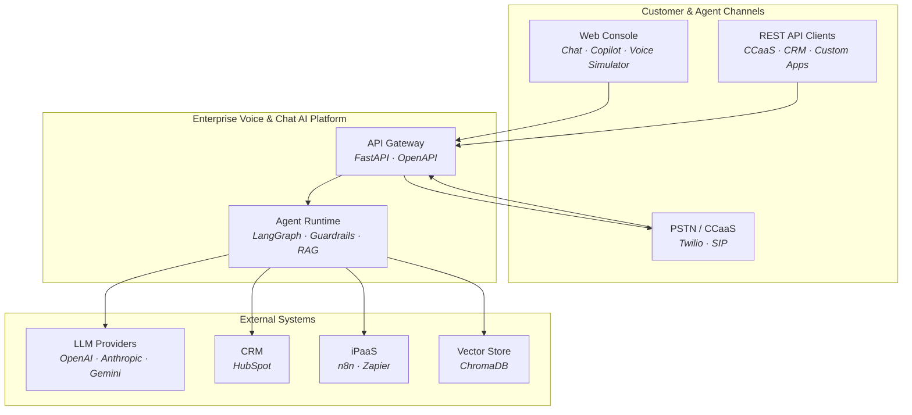
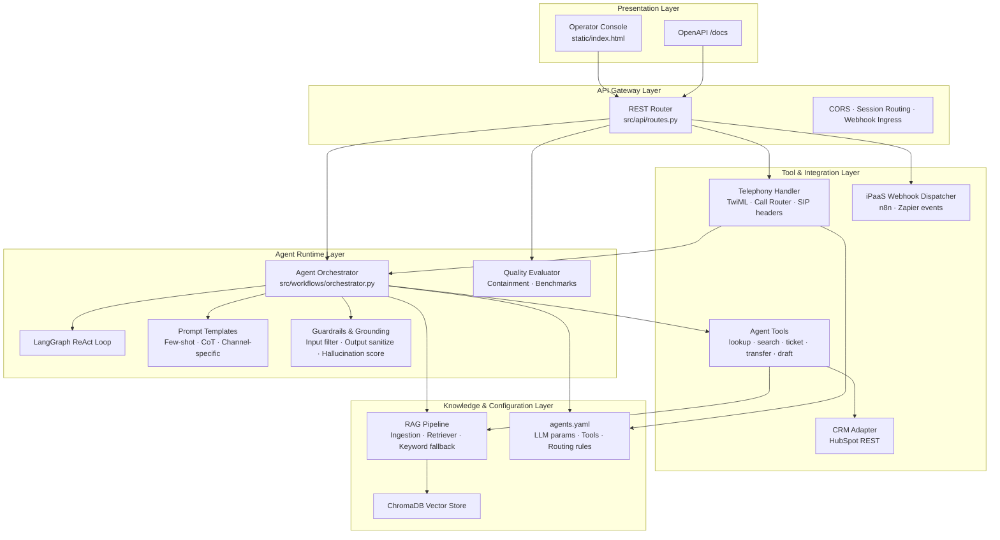
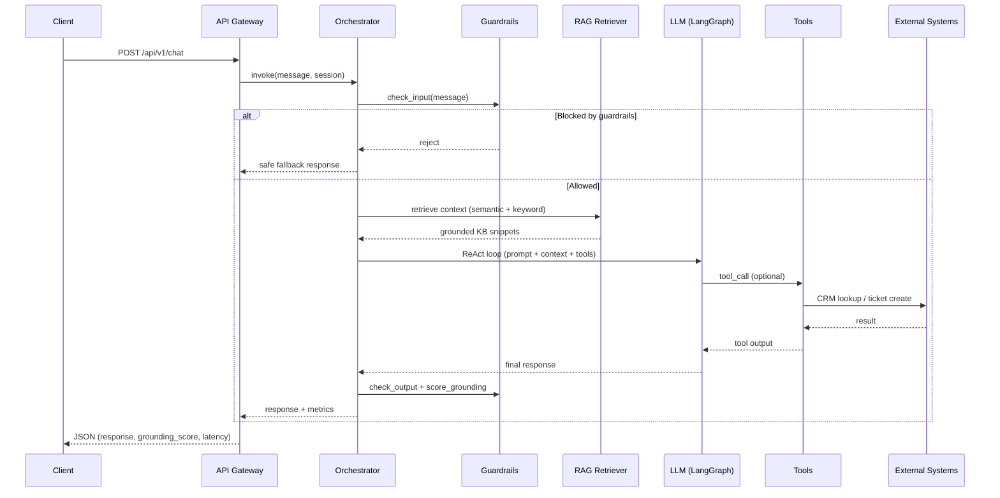
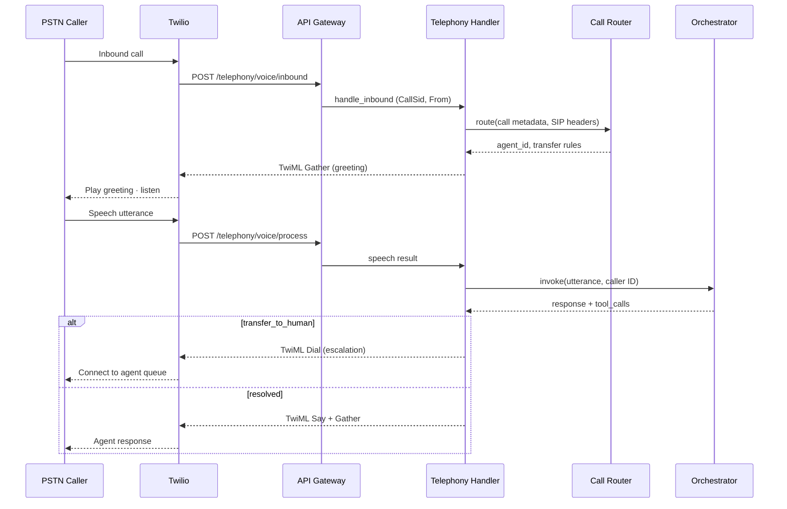
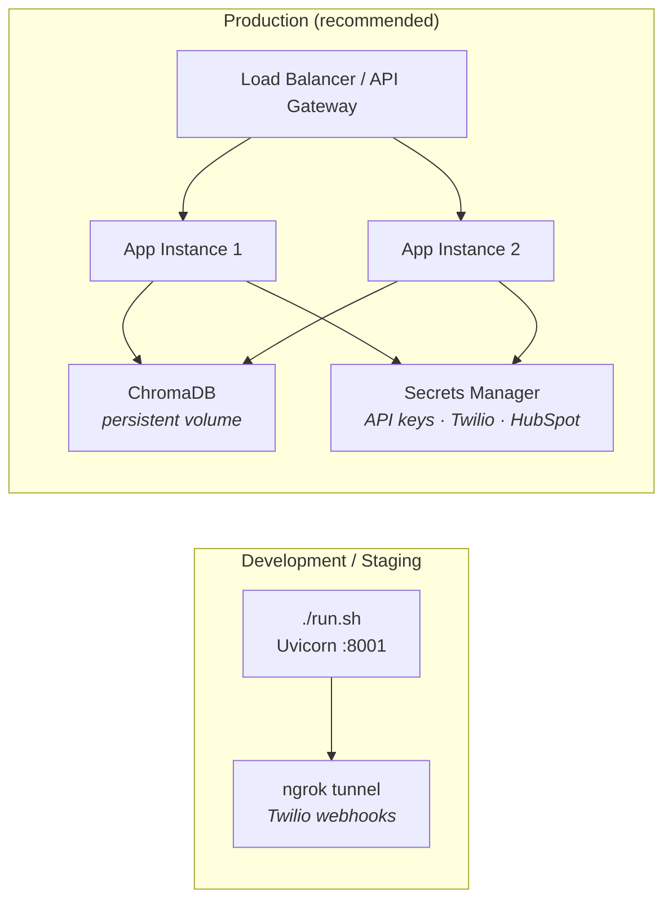

# Enterprise Voice & Chat AI Agent Platform

A production-grade **enterprise AI agent platform** for deploying and operating omnichannel voice agents, chat agents, and agent-assist copilots — with RAG, CRM integrations, telephony (Twilio/SIP/PSTN), quality evaluation, and iPaaS event routing.

Designed for enterprise contact centers, CCaaS deployments, and customer-support automation at scale.

**Repository:** [github.com/ShubhamRSY/voice-agents](https://github.com/ShubhamRSY/voice-agents)

---

## Overview

The platform runs AI support agents across multiple customer-facing channels:

| Channel | What it does |
|---------|----------------|
| **Chat** | Text-based support with tool calling and session memory |
| **Voice** | PSTN/CCaaS call flow via Twilio webhooks (with in-browser simulator) |
| **Copilot** | Agent-assist that drafts responses for human support reps |

Agents can search a knowledge base (RAG), look up customers (CRM), create tickets, escalate to humans, and emit events to external systems (n8n/Zapier).

---

## Features

- **Multi-agent orchestration** — LangGraph ReAct agents with configurable tools per agent
- **Prompt design** — Channel-specific templates for voice, chat, and copilot (`src/prompts/templates.py`)
- **RAG pipeline** — Document ingestion, ChromaDB vector store, keyword + semantic retrieval
- **LLM providers** — OpenAI, Anthropic, Gemini via unified factory; mock fallback when no API key
- **Telephony** — Twilio voice webhooks, TwiML generation, call routing, SIP header extraction, human transfer
- **CRM integration** — HubSpot adapter with graceful degradation when credentials are unavailable
- **iPaaS webhooks** — Outbound events for n8n/Zapier (`integrations/templates/`)
- **Evaluation framework** — Automated test suites for containment, tool accuracy, latency, grounding, and hallucination rate
- **LLM parameter control** — Temperature, max tokens, top P, top K, repetition penalty, stop sequences, n sequences
- **Guardrails** — Prompt-injection blocking and output sanitization
- **Grounding & hallucination checks** — Per-response grounding score and risk level
- **Few-shot & chain-of-thought prompting** — Configurable per agent in YAML
- **Benchmarks** — Standardized benchmark suite for quality regression testing
- **Web UI** — Chat, Copilot, and Voice Call Simulator at `http://127.0.0.1:8001/`
- **REST API** — Full FastAPI surface with OpenAPI docs at `/docs`

---

## Architecture

### Design Principles

| Principle | Description |
|-----------|-------------|
| **Omnichannel** | Single orchestration core serves chat, voice, and copilot with channel-specific prompts and tools |
| **Configuration-driven** | Agent behavior, LLM parameters, and routing rules defined in `config/agents.yaml` — no code changes required |
| **Layered separation** | API gateway, agent runtime, integrations, and data stores are independently replaceable |
| **Grounded responses** | RAG retrieval precedes generation; every response carries grounding and hallucination metrics |
| **Graceful degradation** | Offline rule engine and keyword search when LLM or CRM credentials are unavailable |
| **Observable by default** | Structured logging, per-request metrics, and automated evaluation for regression control |

### System Context



### Layered Architecture



### Request Flow — Chat Channel



### Request Flow — Voice Channel (PSTN)



### Component Reference

| Layer | Component | Responsibility | Module |
|-------|-----------|----------------|--------|
| Presentation | Operator Console | Chat, copilot, and voice simulation UI | `static/index.html` |
| API Gateway | REST Router | HTTP ingress, session management, OpenAPI | `src/api/routes.py` |
| API Gateway | Application Host | Lifespan, CORS, static asset serving | `src/main.py` |
| Agent Runtime | Orchestrator | Session state, RAG injection, LLM invocation | `src/workflows/orchestrator.py` |
| Agent Runtime | LangGraph Agent | ReAct reasoning loop with tool calling | `src/workflows/orchestrator.py` |
| Agent Runtime | Prompt Engine | Channel templates, few-shot, chain-of-thought | `src/prompts/templates.py` |
| Agent Runtime | LLM Factory | Multi-provider model instantiation | `src/llm/factory.py` |
| Agent Runtime | Parameter Resolver | Temperature, top_p, stop sequences per agent | `src/llm/params.py` |
| Agent Runtime | Guardrails | Prompt-injection blocking, output sanitization | `src/llm/guardrails.py` |
| Agent Runtime | Grounding Scorer | Hallucination risk and KB overlap metrics | `src/llm/hallucination.py` |
| Agent Runtime | Evaluator | Containment, tool accuracy, benchmark regression | `src/evaluation/evaluator.py` |
| Tools | Agent Tools | CRM lookup, KB search, ticketing, transfer | `src/agents/tools.py` |
| Integration | Telephony Handler | TwiML generation, speech gather, call sessions | `src/telephony/twilio_handler.py` |
| Integration | Call Router | Skill-based routing, VIP detection, SIP headers | `src/telephony/call_router.py` |
| Integration | CRM Adapter | HubSpot contact lookup and updates | `src/integrations/crm.py` |
| Integration | Webhook Dispatcher | Outbound lifecycle events to iPaaS | `src/integrations/webhooks.py` |
| Knowledge | RAG Pipeline | Document ingestion, chunking, embedding | `src/rag/ingestion.py` |
| Knowledge | Retriever | Semantic search with keyword fallback | `src/rag/retriever.py` |
| Knowledge | Vector Store | ChromaDB persistence and query | `src/rag/vector_store.py` |
| Configuration | Agent Registry | Per-channel agents, tools, LLM and telephony config | `config/agents.yaml` |

### Deployment Topology



**Current default:** single-process Uvicorn deployment suitable for development, staging, and pilot rollouts. For production scale, run multiple stateless app instances behind a load balancer, persist ChromaDB to shared storage, and inject credentials via a secrets manager. Voice sessions are keyed by `CallSid`; chat sessions are keyed by `session_id`.

---

## Tech Stack

| Layer | Technology |
|-------|------------|
| API | FastAPI, Uvicorn |
| Orchestration | LangChain, LangGraph |
| LLMs | OpenAI GPT-4o-mini, Anthropic, Gemini |
| Vector DB | ChromaDB |
| Telephony | Twilio (TwiML, webhooks) |
| CRM | HubSpot REST API |
| Testing | pytest |
| Frontend | HTML/CSS/JS (single-page UI) |

---

## Quick Start

### Prerequisites

- Python 3.11+
- (Optional) OpenAI API key for real LLM responses

### 1. Clone and install

```bash
git clone https://github.com/ShubhamRSY/voice-agents.git
cd voice-agents

python3 -m venv .venv
source .venv/bin/activate
pip install -r requirements.txt
pip install -e .
```

### 2. Configure environment (optional)

```bash
cp .env.example .env
# Edit .env and add your OPENAI_API_KEY
```

> **No API key?** The platform falls back to mock mode automatically — chat, voice simulator, and tests still work.

### 3. Ingest the sample knowledge base

```bash
python scripts/ingest_kb.py data/knowledge_base/
```

### 4. Start the server

```bash
./run.sh
```

### 5. Open the app

| URL | Description |
|-----|-------------|
| [http://127.0.0.1:8001/](http://127.0.0.1:8001/) | Web UI (Chat, Copilot, Voice) |
| [http://127.0.0.1:8001/docs](http://127.0.0.1:8001/docs) | Interactive API documentation |

---

## Web UI

The built-in UI has three modes:

### Chat
Test the support agent with natural language. Try:
- `How do I reset my password?`
- `Can you look up jane@example.com?`
- `My API calls return 403 errors`

### Copilot
Paste a conversation summary and ask the copilot to draft a response for the human agent.

### Voice (Call Simulator)
Simulates a PSTN phone call without Twilio:
1. Click **Answer Incoming Call** — hear the agent greeting (TTS simulation)
2. Type what the caller says — e.g. `How do I reset my password?`
3. Try escalation — `I need to speak to a manager`

Shows telephony metadata: routing, transfer numbers, gather/listen states.

---

## Agents

Three agents are configured in `config/agents.yaml`:

| Agent ID | Channel | Tools |
|----------|---------|-------|
| `chat_support` | Chat | lookup_customer, search_knowledge_base, create_ticket, update_crm |
| `voice_support` | Voice | lookup_customer, search_knowledge_base, create_ticket, transfer_to_human |
| `copilot` | Copilot | search_knowledge_base, draft_response, summarize_conversation |

Each agent has its own LLM model, temperature, token limits, and containment targets.

---

## LLM Configuration

All LLM generation parameters are **user-configurable** per agent in `config/agents.yaml`:

| Parameter | What it does | Config key |
|-----------|--------------|------------|
| **Max Tokens** | Output length limit | `max_tokens` |
| **Temperature** | Randomness (0 = focused, 2 = creative) | `temperature` |
| **Top P** | Nucleus sampling probability cutoff | `llm.top_p` |
| **Top K** | Limit to top K tokens (Anthropic) | `llm.top_k` |
| **Frequency Penalty** | Reduce repeated words | `llm.frequency_penalty` |
| **Presence Penalty** | Encourage new topics | `llm.presence_penalty` |
| **Stop Sequences** | Stop generation at phrases | `llm.stop_sequences` |
| **Num Return Sequences** | Multiple completions (copilot: 2) | `llm.n` |
| **Chain of Thought** | Internal step-by-step reasoning | `llm.chain_of_thought` |
| **Few-Shot** | Example Q&A in system prompt | `llm.few_shot_enabled` |

**View live config:**
```bash
curl http://127.0.0.1:8001/api/v1/llm/config
```

**Example agent LLM block:**
```yaml
chat_support:
  temperature: 0.4
  max_tokens: 1024
  llm:
    top_p: 0.95
    frequency_penalty: 0.2
    chain_of_thought: true
    few_shot_enabled: true
    stop_sequences: []
```

### Guardrails

Enabled in `config/agents.yaml` under `guardrails:`:
- Blocks prompt injection / jailbreak attempts
- Sanitizes outputs that leak system prompts
- Returns a safe fallback message when input is blocked

### Grounding & Hallucination Detection

Every LLM response includes metrics:
```json
{
  "grounding_score": 0.42,
  "hallucination_risk": "low",
  "llm_params": { "temperature": 0.4, "top_p": 0.95 }
}
```

- **grounding_score** — overlap between response and RAG context
- **hallucination_risk** — `low` / `medium` / `high` based on grounding

### LLM Concepts Covered

| Concept | Implementation |
|---------|------------------|
| System / User prompts | `src/prompts/templates.py` |
| RAG grounding | ChromaDB + keyword fallback |
| Few-shot prompting | Examples in chat/copilot prompts |
| Chain of thought | Internal reasoning instruction |
| Agent + tool calling | LangGraph ReAct loop |
| Guardrails | `src/llm/guardrails.py` |
| Hallucination detection | `src/llm/hallucination.py` |
| Inference latency | `response_time_ms` in metrics |
| Benchmarks | `tests/evaluation/benchmarks.json` |

---

## API Reference

| Method | Endpoint | Description |
|--------|----------|-------------|
| `GET` | `/api/v1/health` | Health check |
| `POST` | `/api/v1/chat` | Send a chat message |
| `POST` | `/api/v1/copilot` | Copilot assist request |
| `DELETE` | `/api/v1/chat/{session_id}` | End a chat session |
| `GET` | `/api/v1/agents` | List configured agents (with LLM params) |
| `GET` | `/api/v1/llm/config` | View all user-configurable LLM parameters |
| `POST` | `/api/v1/rag/ingest` | Ingest documents into vector store |
| `POST` | `/api/v1/rag/search` | Search knowledge base |
| `POST` | `/api/v1/telephony/simulate` | Simulate a voice call (no Twilio needed) |
| `POST` | `/api/v1/telephony/voice/inbound` | Twilio inbound webhook |
| `POST` | `/api/v1/telephony/voice/process` | Twilio speech processing webhook |
| `POST` | `/api/v1/telephony/voice/status` | Twilio call status callback |
| `POST` | `/api/v1/integrations/webhooks` | Register iPaaS webhook URL |
| `POST` | `/api/v1/evaluation/run` | Run automated evaluation suite |

### Example: Chat

```bash
curl -X POST http://127.0.0.1:8001/api/v1/chat \
  -H "Content-Type: application/json" \
  -d '{
    "message": "How do I reset my password?",
    "session_id": "demo-1",
    "agent_id": "chat_support"
  }'
```

### Example: Voice simulation

```bash
curl -X POST http://127.0.0.1:8001/api/v1/telephony/simulate \
  -H "Content-Type: application/json" \
  -d '{
    "call_sid": "SIM-001",
    "from_number": "+15551234567",
    "speech": "How do I reset my password?"
  }'
```

---

## Telephony (Real Phone Calls via Twilio)

To connect a real phone number:

1. Add Twilio credentials to `.env`:
   ```
   TWILIO_ACCOUNT_SID=AC...
   TWILIO_AUTH_TOKEN=...
   TWILIO_PHONE_NUMBER=+1...
   TWILIO_WEBHOOK_BASE_URL=https://your-ngrok-url.ngrok.io
   ```

2. Expose your local server:
   ```bash
   ngrok http 8001
   ```

3. Set your Twilio phone number voice webhook to:
   - **Inbound:** `POST {WEBHOOK_BASE_URL}/api/v1/telephony/voice/inbound`
   - **Status callback:** `POST {WEBHOOK_BASE_URL}/api/v1/telephony/voice/status`

Call routing supports skill-based rules, VIP caller detection, SIP `X-*` header extraction, and fallback destinations (`src/telephony/call_router.py`).

---

## iPaaS Integrations (n8n / Zapier)

The platform emits lifecycle events to external webhook URLs:

| Event | When |
|-------|------|
| `conversation.started` | New chat session begins |
| `conversation.ended` | Session closed |
| `ticket.created` | Support ticket created |
| `conversation.escalated` | Human transfer requested |

**Register a webhook:**
```bash
curl -X POST http://127.0.0.1:8001/api/v1/integrations/webhooks \
  -H "Content-Type: application/json" \
  -d '{"event_type":"conversation.started","url":"https://hooks.zapier.com/hooks/catch/XXXX/YYYY"}'
```

**Templates:**
- `integrations/templates/n8n-workflow.json` — import into n8n
- `integrations/templates/zapier-setup.md` — Zapier Catch Hook guide

---

## Evaluation

Run automated quality tests against the agent:

```bash
python scripts/run_evaluation.py
```

Or via API: `POST /api/v1/evaluation/run`

Metrics tracked:
- **Containment rate** — % of queries resolved without escalation
- **Tool accuracy** — correct tool selection (lookup, search, transfer)
- **Response time** — latency in milliseconds
- **Hallucination rate** — % of responses with high hallucination risk
- **Grounding score** — average overlap with retrieved KB context
- **Benchmarks** — standardized regression tests (`tests/evaluation/benchmarks.json`)

Test cases live in `tests/evaluation/test_cases.json`.

---

## Project Structure

```
voice-agents/
├── config/
│   └── agents.yaml              # Agent definitions, RAG & eval settings
├── data/
│   └── knowledge_base/          # Sample FAQ documents
├── integrations/
│   └── templates/               # n8n & Zapier workflow templates
├── scripts/
│   ├── demo_chat.py             # CLI chat demo
│   ├── ingest_kb.py             # Knowledge base ingestion
│   └── run_evaluation.py        # Evaluation runner
├── src/
│   ├── agents/tools.py          # LangChain tool definitions
│   ├── api/routes.py            # REST API endpoints
│   ├── evaluation/evaluator.py  # Quality & containment testing
│   ├── integrations/
│   │   ├── crm.py               # HubSpot CRM adapter
│   │   └── webhooks.py          # iPaaS event dispatcher
│   ├── llm/
│   │   ├── factory.py           # Multi-provider LLM factory
│   │   ├── params.py            # User-configurable LLM parameters
│   │   ├── guardrails.py        # Input/output safety checks
│   │   └── hallucination.py     # Grounding & hallucination scoring
│   ├── prompts/templates.py     # Voice / chat / copilot prompts (few-shot, CoT)
│   ├── rag/                     # Ingestion, vector store, retrieval
│   ├── telephony/               # Twilio handler, call router, TwiML parser
│   └── workflows/orchestrator.py # LangGraph agent orchestration
├── static/
│   └── index.html               # Web UI
├── tests/
│   ├── evaluation/test_cases.json
│   ├── evaluation/benchmarks.json
│   ├── test_platform.py
│   └── test_llm_features.py
├── .env.example
├── requirements.txt
├── run.sh                       # One-command startup script
└── README.md
```

---

## Environment Variables

Copy `.env.example` to `.env`:

| Variable | Required | Description |
|----------|----------|-------------|
| `OPENAI_API_KEY` | Optional | Enables real GPT responses and OpenAI embeddings |
| `ANTHROPIC_API_KEY` | Optional | For Anthropic-powered copilot |
| `TWILIO_ACCOUNT_SID` | Optional | Real phone call integration |
| `TWILIO_AUTH_TOKEN` | Optional | Twilio auth |
| `TWILIO_PHONE_NUMBER` | Optional | Your Twilio number |
| `TWILIO_WEBHOOK_BASE_URL` | Optional | ngrok or production URL |
| `HUBSPOT_API_KEY` | Optional | Real HubSpot CRM (mock used if empty) |

---

## Running Tests

```bash
pytest tests/ -v
```

Expected: **14 tests passing** (routing, prompts, tools, CRM, guardrails, grounding, LLM params).

---

## Deployment Verification

Standard smoke test after install or release:

1. **Start services:** `./run.sh` → open [http://127.0.0.1:8001/](http://127.0.0.1:8001/)
2. **Chat channel:** *"How do I reset my password?"* — verify RAG retrieval and tool invocation
3. **CRM lookup:** *"Can you look up jane@example.com?"* — verify customer record resolution
4. **Voice channel:** Voice tab → answer inbound call → submit utterance → request escalation — verify transfer routing
5. **API surface:** `/docs` — exercise telephony simulate and evaluation endpoints
6. **Observability:** Confirm `grounding_score`, `hallucination_risk`, and `response_time_ms` in API responses

---

## Enterprise Capabilities

| Capability | Implementation |
|------------|----------------|
| Prompt & workflow configuration | Few-shot and chain-of-thought templates per channel |
| LLM orchestration | LangChain / LangGraph with per-agent parameter control |
| Knowledge grounding | ChromaDB RAG + keyword fallback with grounding scores |
| Safety & compliance | Input guardrails, output sanitization, hallucination risk scoring |
| System integrations | REST API, HubSpot CRM, n8n/Zapier webhooks |
| Telephony | Twilio PSTN/CCaaS, SIP header routing, human transfer |
| Quality assurance | Containment, tool accuracy, latency, and benchmark regression tests |

---

## License

MIT — free to use, modify, and distribute.

## Author

**Shubham RSY** — [github.com/ShubhamRSY](https://github.com/ShubhamRSY)
